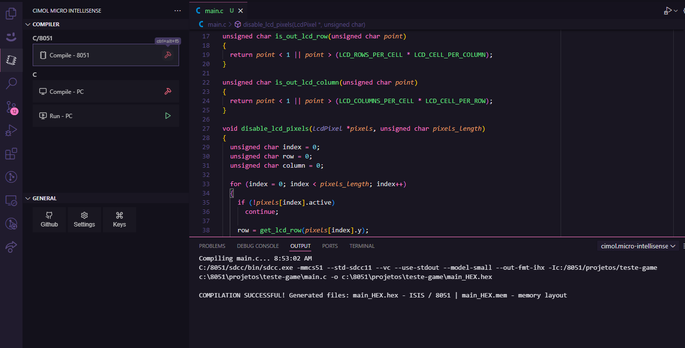

# cimol.micro-intellisense

**Description:** The "cimol.micro-intellisense" is an extension developed to assist in microcontroller development. It supports the c_cpp extension without the need for configuration.

## Feats

- **Compile 8051:** Compiles for the 8051 microcontroller using the executable of the `sdcc` compiler specified in the settings.
- **Compile PC:** Compiles for the PC using the executable of the `tinyc` compiler specified in the settings.
- **Run PC** Executes the file generated by the `tinyc` compiler.

## For more

- [Github](https://github.com/edsonfischborn/cimol.micro-intellisense)

By [edsonfischborn](https://www.linkedin.com/in/edsonfischborn) Initially developed for [CIMOL](https://www.cimol.g12.br/)
